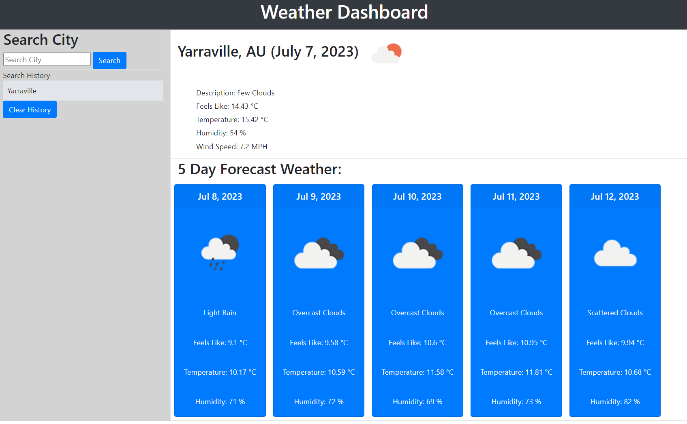

# Module-06-Challenge
Bootcamp Module 06 Challenge - Weather Dashboard

This assignment is is to build a weather dashboard that will run in the browser and feature dynamically updated HTML and CS while retrieving data from another application's API and using it in the context of their own.

# The acceptance criteria is as follow :
- GIVEN a weather dashboard with form inputs
- WHEN I search for a city
- THEN I am presented with current and future conditions for that city and that city is added to the search history
- WHEN I view current weather conditions for that city
- THEN I am presented with the city name, the date, an icon representation of weather conditions, the temperature, the humidity, and the wind speed
- WHEN I view future weather conditions for that city
- THEN I am presented with a 5-day forecast that displays the date, an icon representation of weather conditions, the temperature, the wind speed, and the humidity
- WHEN I click on a city in the search history
- THEN I am again presented with current and future conditions for that city

# Deployment:
1. Website ; https://momentes.github.io/06-Weather-Dashboard/

# Screenshot
How my website looks like.

# Credits for References & Learning Resources:
1. Website Credits - W3schools
2. Website Credits - StackOverFlow
3. Website Credits - Markdownguide.org

This project is for Private use/learning classes and not for commerical or public consumption.

Thank you
End.        

